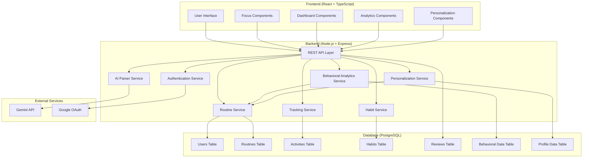

# Design Document: Student Discipline System

## Overview

The Student Discipline System is a production-grade web application that helps students maintain consistency, focus, and productivity through systematic daily routines. Built on principles from Atomic Habits and Deep Work, the system emphasizes discipline through systems rather than motivation, providing personalized daily routines, natural language interaction, and comprehensive progress tracking.

The application follows a modern full-stack architecture with React/TypeScript frontend, Node.js/Express backend, PostgreSQL database, and optional AI integration via Gemini API free tier.

## Architecture

### High-Level Architecture



### Advanced Personalization Architecture

The system implements a sophisticated personalization engine that learns from user behavior and adapts over time:

**Data Collection Layer**:
- **Explicit Data**: Questionnaires, profile setup, user preferences
- **Implicit Data**: Interaction patterns, task completion rates, feature usage
- **Contextual Data**: Time of day, weather, seasonal patterns, life circumstances

**Analysis Layer**:
- **Pattern Recognition**: Identifies temporal productivity patterns, energy cycles, and behavioral trends
- **Correlation Analysis**: Tracks relationships between contextual factors and performance
- **Preference Learning**: Infers user preferences from behavior without explicit input

**Adaptation Layer**:
- **Routine Optimization**: Adjusts routine generation based on learned patterns
- **Coaching Personalization**: Customizes tone and suggestion types to user preferences
- **Complexity Management**: Dynamically adjusts task density and challenge level

**Feedback Loop**:
- **Effectiveness Tracking**: Measures success of adaptations
- **Continuous Refinement**: Updates personalization models based on outcomes
- **A/B Testing**: Experiments with different approaches to find optimal strategies

**Design Rationale**: This multi-layered approach ensures the system becomes more effective over time while maintaining transparency and user control. By combining explicit and implicit data collection, the system can personalize without requiring constant manual updates from users.

### Behavioral Analytics and Adaptive Learning

The system implements continuous learning through behavioral analytics:

**Interaction Tracking**:
- **Click-through Rates**: Measures which suggestions users act on
- **Task Completion Times**: Identifies optimal task durations and scheduling
- **Feature Usage Patterns**: Determines which features provide most value
- **Modification Patterns**: Learns from how users adjust generated routines

**Pattern Analysis**:
- **Temporal Patterns**: Identifies productivity peaks by time of day, day of week, and season
- **Contextual Correlations**: Tracks relationships between environment, weather, and performance
- **Success Indicators**: Recognizes patterns that lead to successful task completion
- **Failure Signals**: Identifies conditions that predict routine abandonment

**Adaptive Algorithms**:
- **Routine Complexity Adjustment**: Automatically simplifies or increases challenge based on success rates
- **Scheduling Optimization**: Places tasks at times when user is most likely to complete them
- **Break Timing**: Adjusts break frequency and duration based on observed focus patterns
- **Coaching Tone**: Adapts communication style based on user response patterns

**Privacy-Preserving Design**:
- All behavioral data is stored securely and associated only with user accounts
- Analytics are performed on individual user data, not across users
- Users can view and delete their behavioral data at any time
- No personally identifiable information is used in pattern analysis

**Design Rationale**: By learning from actual behavior rather than just stated preferences, the system can adapt to users' real needs and patterns. The privacy-preserving approach ensures users maintain control over their data while benefiting from personalization.

### Technology Stack

- **Frontend**: React 18 + TypeScript + Tailwind CSS
- **Backend**: Node.js + Express + TypeScript
- **Database**: PostgreSQL with time-series optimization
- **Authentication**: JWT + Google OAuth 2.0
- **AI Integration**: Gemini API (free tier only)
- **Charts**: Recharts for analytics visualization
- **Deployment**: Vercel (frontend) + Railway/Render (backend)

### AI Integration Strategy

The system uses Gemini API free tier for natural language processing with a robust fallback architecture:

**Primary AI Features**:
- Natural language command parsing ("studied math for 1 hour")
- Activity suggestion generation
- Coaching response generation

**Fallback Mechanisms**:
- **Availability Check**: System checks AI service availability before attempting requests
- **Manual Input Alternative**: Every AI-powered feature has a manual form-based alternative
- **Graceful Degradation**: UI automatically switches to manual mode when AI is unavailable
- **Rate Limit Handling**: Implements exponential backoff and request queuing for rate limits
- **Error Recovery**: Stores failed requests for retry when service becomes available

**Design Rationale**: By treating AI as an enhancement rather than a requirement, the system remains fully functional even when external services fail. This approach ensures reliability while providing improved UX when AI is available. The free tier constraint (20 requests/day) is managed through intelligent caching and request prioritization.

## Components and Interfaces

### Frontend Components

#### Core UI Components
- **AppLayout**: Main application shell with navigation and routing
- **FocusScreen**: Distraction-free current task display
- **DashboardScreen**: Analytics and progress overview
- **RoutineScreen**: Daily routine display and management
- **HabitTracker**: Habit monitoring and streak visualization
- **EveningReview**: Daily reflection interface
- **SettingsScreen**: User profile and preferences

#### Specialized Components
- **NaturalLanguageInput**: Text/voice input with AI parsing and fallback
- **TimeTracker**: Real-time activity tracking widget
- **ProgressCharts**: Recharts-based analytics visualization
- **IdentityProfile**: Target identity and goal management
- **EnvironmentDesigner**: Distraction management tools
- **DetailedProfileQuestionnaire**: Comprehensive user profiling interface
- **BehavioralPatternVisualization**: Display of learned user patterns
- **PersonalizationMetrics**: Dashboard showing personalization effectiveness

### Backend Services

#### Authentication Service
```typescript
interface AuthService {
  register(email: string, password: string): Promise<User>
  login(email: string, password: string): Promise<AuthToken>
  googleAuth(token: string): Promise<AuthToken>
  validateToken(token: string): Promise<User>
  refreshToken(refreshToken: string): Promise<AuthToken>
}
```

#### Routine Generation Service
```typescript
interface RoutineService {
  generateDailyRoutine(userId: string, date: Date): Promise<DailyRoutine>
  adaptRoutine(userId: string, performance: PerformanceData): Promise<void>
  getRoutineHistory(userId: string, dateRange: DateRange): Promise<DailyRoutine[]>
  updateRoutinePreferences(userId: string, preferences: RoutinePreferences): Promise<void>
}
```

#### Activity Tracking Service
```typescript
interface TrackingService {
  startActivity(userId: string, activity: ActivityStart): Promise<ActivitySession>
  stopActivity(sessionId: string): Promise<ActivitySession>
  logActivity(userId: string, activity: ActivityLog): Promise<void>
  getTimeUtilization(userId: string, date: Date): Promise<TimeUtilization>
  getDailyStats(userId: string, date: Date): Promise<DailyStats>
}
```

#### Habit Management Service
```typescript
interface HabitService {
  createHabit(userId: string, habit: HabitDefinition): Promise<Habit>
  logHabitCompletion(userId: string, habitId: string, date: Date): Promise<void>
  getHabitStreaks(userId: string): Promise<HabitStreak[]>
  suggestHabitStacks(userId: string): Promise<HabitStackSuggestion[]>
  calculateConsistencyScore(userId: string): Promise<number>
}
```

#### AI Parser Service
```typescript
interface AIParserService {
  parseNaturalLanguage(input: string, context: UserContext): Promise<ParsedCommand>
  generateResponse(command: ParsedCommand, userState: UserState): Promise<string>
  fallbackToManualInput(input: string): Promise<ManualInputOptions>
  checkAvailability(): Promise<boolean>
  handleRateLimit(): Promise<void>
}
```

#### Behavioral Analytics Service
```typescript
interface BehavioralAnalyticsService {
  trackInteraction(userId: string, interaction: InteractionEvent): Promise<void>
  analyzePatterns(userId: string): Promise<BehavioralInsights>
  updatePersonalization(userId: string, insights: BehavioralInsights): Promise<void>
  predictOptimalRoutine(userId: string, context: DailyContext): Promise<RoutineRecommendation>
  trackContextualFactors(userId: string, factors: ContextualFactors): Promise<void>
  calculateAdaptationEffectiveness(userId: string): Promise<AdaptationMetrics>
}
```

#### Personalization Service
```typescript
interface PersonalizationService {
  collectProfileData(userId: string, questionnaire: QuestionnaireResponse): Promise<void>
  updateImplicitPreferences(userId: string, behavior: UserBehavior): Promise<void>
  generatePersonalizedRecommendations(userId: string): Promise<Recommendation[]>
  optimizeCoachingTone(userId: string): Promise<CoachingStyle>
  runABTest(userId: string, variants: Variant[]): Promise<SelectedVariant>
  analyzeTemporalPatterns(userId: string): Promise<TemporalInsights>
}

## Data Models

### User and Identity Models

```typescript
interface User {
  id: string
  email: string
  createdAt: Date
  updatedAt: Date
  profile: UserProfile
  preferences: UserPreferences
}

interface UserProfile {
  targetIdentity: string
  academicGoals: string[]
  skillGoals: string[]
  wakeUpTime: string
  sleepTime: string
  availableHours: number
  energyPattern: EnergyLevel[]
  detailedProfile: DetailedUserProfile
}

interface DetailedUserProfile {
  learningStyle: 'visual' | 'auditory' | 'kinesthetic' | 'reading'
  productivityPeaks: string[]
  distractionTriggers: string[]
  motivationFactors: string[]
  studyEnvironmentPrefs: EnvironmentPreferences
  challengeAreas: string[]
  personalityTraits: PersonalityProfile
  academicBackground: AcademicProfile
  behavioralPatterns: BehavioralAnalytics
  contextualPreferences: ContextualPreferences
  implicitFeedback: ImplicitFeedbackData
}

interface BehavioralAnalytics {
  interactionPatterns: InteractionPattern[]
  taskCompletionRates: Record<string, number>
  featureUsageStats: Record<string, number>
  temporalProductivityPatterns: TemporalPattern[]
  adaptationHistory: AdaptationEvent[]
}

interface InteractionPattern {
  feature: string
  engagementScore: number
  clickThroughRate: number
  completionRate: number
  lastUpdated: Date
}

interface TemporalPattern {
  timeOfDay: string
  dayOfWeek: string
  season: string
  productivityScore: number
  energyLevel: number
  focusQuality: number
}

interface ContextualPreferences {
  weatherPreferences: WeatherPreference[]
  seasonalPatterns: SeasonalPattern[]
  lifeCircumstances: LifeCircumstance[]
  socialContext: SocialContextPreference[]
}

interface ImplicitFeedbackData {
  suggestionAcceptanceRate: number
  routineModificationPatterns: ModificationPattern[]
  skipPatterns: SkipPattern[]
  engagementMetrics: EngagementMetric[]
}

interface AdaptationEvent {
  timestamp: Date
  trigger: string
  adaptation: string
  effectiveness: number
}

interface EnvironmentPreferences {
  preferredLocation: string[]
  noiseLevel: 'silent' | 'quiet' | 'moderate' | 'background_music'
  lightingPreference: 'bright' | 'moderate' | 'dim'
  temperaturePreference: 'cool' | 'moderate' | 'warm'
  organizationStyle: 'minimal' | 'organized' | 'flexible'
}

interface PersonalityProfile {
  workStyle: 'structured' | 'flexible' | 'mixed'
  socialPreference: 'solo' | 'group' | 'mixed'
  feedbackStyle: 'direct' | 'encouraging' | 'analytical'
  challengeLevel: 'gradual' | 'moderate' | 'aggressive'
}

interface AcademicProfile {
  currentLevel: 'high_school' | 'undergraduate' | 'graduate' | 'professional'
  subjects: string[]
  learningGoals: string[]
  timeConstraints: string[]
  previousChallenges: string[]
}

interface UserPreferences {
  theme: 'light' | 'dark'
  notifications: NotificationSettings
  aiEnabled: boolean
  voiceEnabled: boolean
}
```

### Routine and Activity Models

```typescript
interface DailyRoutine {
  id: string
  userId: string
  date: Date
  segments: RoutineSegment[]
  adaptations: string[]
  completed: boolean
  createdAt: Date
}

interface RoutineSegment {
  id: string
  timeSlot: TimeSlot
  type: 'deep_work' | 'study' | 'skill_practice' | 'break' | 'personal'
  activity: string
  duration: number
  priority: 'high' | 'medium' | 'low'
  completed: boolean
}

interface ActivitySession {
  id: string
  userId: string
  activity: string
  startTime: Date
  endTime?: Date
  duration?: number
  focusQuality: 'high' | 'medium' | 'low'
  distractions: number
  notes?: string
}

interface TimeUtilization {
  date: Date
  focusedTime: number
  distractedTime: number
  unusedTime: number
  deepWorkHours: number
  categories: CategoryTime[]
}
```

### Habit and Review Models

```typescript
interface Habit {
  id: string
  userId: string
  name: string
  description: string
  frequency: 'daily' | 'weekly'
  cue: string
  reward: string
  stackedAfter?: string
  createdAt: Date
  isActive: boolean
}

interface HabitCompletion {
  id: string
  habitId: string
  userId: string
  date: Date
  completed: boolean
  quality?: 'excellent' | 'good' | 'poor'
  notes?: string
}

interface EveningReview {
  id: string
  userId: string
  date: Date
  accomplished: string[]
  missed: string[]
  reasons: string[]
  tomorrowTasks: string[]
  mood: number
  energyLevel: number
  insights: string
}
```

### AI and Analytics Models

```typescript
interface ParsedCommand {
  type: 'log_activity' | 'add_task' | 'request_plan' | 'ask_question'
  parameters: Record<string, any>
  confidence: number
  fallbackRequired: boolean
}

interface AnalyticsData {
  userId: string
  period: 'daily' | 'weekly' | 'monthly'
  consistencyScore: number
  identityAlignment: number
  deepWorkTrend: number[]
  habitStreaks: HabitStreak[]
  productivityPattern: ProductivityMetrics
}

interface BehavioralInsights {
  userId: string
  interactionPatterns: InteractionPattern[]
  temporalPatterns: TemporalPattern[]
  preferenceSignals: PreferenceSignal[]
  adaptationRecommendations: AdaptationRecommendation[]
  confidenceScore: number
}

interface PreferenceSignal {
  feature: string
  preference: 'positive' | 'negative' | 'neutral'
  strength: number
  evidence: string[]
  lastUpdated: Date
}

interface AdaptationRecommendation {
  type: 'routine_complexity' | 'coaching_tone' | 'task_density' | 'break_frequency'
  currentValue: any
  recommendedValue: any
  reasoning: string
  expectedImpact: number
}

interface ABTestVariant {
  id: string
  name: string
  feature: string
  configuration: Record<string, any>
  userAssignments: string[]
  metrics: VariantMetrics
}

interface VariantMetrics {
  engagementRate: number
  completionRate: number
  satisfactionScore: number
  sampleSize: number
}

interface ContextualFactors {
  timeOfDay: string
  dayOfWeek: string
  weather?: string
  season: string
  recentActivities: string[]
  energyLevel: number
  stressLevel?: number
}

interface RoutineRecommendation {
  segments: RoutineSegment[]
  reasoning: string
  confidenceScore: number
  personalizationFactors: string[]
  expectedEffectiveness: number
}
```

## Correctness Properties

*A property is a characteristic or behavior that should hold true across all valid executions of a system—essentially, a formal statement about what the system should do. Properties serve as the bridge between human-readable specifications and machine-verifiable correctness guarantees.*

### Property 1: Profile Data Persistence and Usage
*For any* user profile data (identity, goals, schedule, energy patterns), when stored in the system, it should persist across sessions and be available for routine generation calculations.
**Validates: Requirements 1.2, 1.3, 1.4**

### Property 2: Profile Completeness Validation
*For any* incomplete user profile, routine generation should be blocked until all required information is provided.
**Validates: Requirements 1.5**

### Property 3: Daily Routine Structure Consistency
*For any* generated daily routine, it should contain exactly three segments (morning, afternoon, evening) and include all required activity types (deep work, study, skill practice, breaks, personal tasks).
**Validates: Requirements 2.2, 2.3**

### Property 4: Routine Generation Input Dependency
*For any* routine generation request, the output should demonstrably incorporate user goals, available time, energy level, and habit history as input factors.
**Validates: Requirements 2.1**

### Property 5: Adaptive Routine Complexity Management
*For any* user with consistent performance patterns (success or failure), future routine complexity should adapt accordingly - simplifying after failures and gradually increasing after successes.
**Validates: Requirements 2.5, 2.6, 9.1, 9.4**

### Property 6: Time Tracking Round Trip Consistency
*For any* activity session, starting tracking then stopping should produce an accurate duration record that matches the actual elapsed time within reasonable tolerance.
**Validates: Requirements 3.1, 3.2**

### Property 7: Time Categorization Completeness
*For any* tracked time period, all time should be categorized as either focused, distracted, or unused with no gaps or overlaps.
**Validates: Requirements 3.3**

### Property 8: Multi-Modal Input Consistency
*For any* activity logging operation, both manual entry and real-time tracking should produce equivalent results when given the same activity data.
**Validates: Requirements 3.4**

### Property 9: Data Visualization Completeness
*For any* time tracking data, all collected metrics should be properly formatted and available for chart visualization and historical analysis.
**Validates: Requirements 3.5, 3.6**

### Property 10: Natural Language Processing Round Trip
*For any* valid natural language command, the AI parser should convert it to structured data that can be executed by the system, with fallback to manual input when parsing fails.
**Validates: Requirements 4.1, 4.4, 4.6**

### Property 11: Text Input Reliability
*For any* system functionality, text input should always be available and functional regardless of AI or voice feature availability.
**Validates: Requirements 4.2**

### Property 12: Focus Screen Content Minimalism
*For any* focus screen display, it should contain exactly the required elements (main focus, current task, time remaining, next action) and exclude all non-essential information.
**Validates: Requirements 5.1, 5.2**

### Property 13: Real-Time Task Display Updates
*For any* task completion event, the focus screen should update immediately to reflect the new current task and remaining activities.
**Validates: Requirements 5.3, 5.4**

### Property 14: Habit Streak Calculation Accuracy
*For any* sequence of habit completion records, the calculated streak length should accurately reflect consecutive completion days with proper handling of missed days.
**Validates: Requirements 6.1, 6.2**

### Property 15: Never Miss Twice Support Activation
*For any* habit that is missed once, the system should provide additional support mechanisms to prevent a second consecutive miss.
**Validates: Requirements 6.3**

### Property 16: Consistency Score Calculation
*For any* set of habit completion data, the consistency score should accurately reflect the completion rate and align with the user's actual performance patterns.
**Validates: Requirements 6.4**

### Property 17: Habit Stacking Opportunity Recognition
*For any* user with established consistent habits, the system should identify and suggest appropriate habit stacking opportunities following the "After I [existing], I will [new]" format.
**Validates: Requirements 6.5, 12.1, 12.3**

### Property 18: Evening Review Content Completeness
*For any* evening review session, the system should prompt for all required reflection elements (accomplished, missed, reasons, tomorrow tasks) and store responses for future analysis.
**Validates: Requirements 7.2, 7.3, 7.5**

### Property 19: Review-Based Routine Adaptation
*For any* evening review data indicating performance issues, the next day's routine should be automatically adjusted to address identified problems.
**Validates: Requirements 7.4**

### Property 20: Dashboard Analytics Completeness
*For any* analytics dashboard view, all specified metrics (consistency, time utilization, deep work hours, habit streaks, identity alignment, progress trends) should be displayed with current data.
**Validates: Requirements 8.1, 8.2**

### Property 21: Performance Pattern Recognition and Response
*For any* detected pattern of declining performance, the system should automatically suggest specific routine adjustments rather than generic motivational content.
**Validates: Requirements 8.4, 9.2**

### Property 22: Continuous Optimization Feedback Loop
*For any* user success pattern data, the system should incorporate this information into future routine generation to improve effectiveness over time.
**Validates: Requirements 9.5**

### Property 23: Responsive Design Functionality
*For any* screen size or device type, the user interface should remain fully functional and properly formatted without loss of core features.
**Validates: Requirements 10.2**

### Property 24: Authentication Method Availability
*For any* user registration or login attempt, both email/password and Google OAuth methods should be available and functional.
**Validates: Requirements 11.1**

### Property 25: Secure Data Storage After Authentication
*For any* successful authentication, all user personal data should be securely stored in the PostgreSQL database with proper encryption and access controls.
**Validates: Requirements 11.2**

### Property 26: Database Performance Optimization
*For any* time-series analytics query, the database structure should be optimized to provide reasonable response times for historical data analysis.
**Validates: Requirements 11.4**

### Property 27: Data Export Functionality
*For any* user data export request, the system should successfully generate and provide a complete export of the user's personal data in a portable format.
**Validates: Requirements 11.5**

### Property 28: Environmental Cue Integration
*For any* habit formation process, the system should identify relevant environmental cues and integrate them into habit tracking and stacking suggestions.
**Validates: Requirements 12.2, 12.4**

### Property 29: Behavioral Chain Recognition
*For any* set of habits that are consistently performed together, the system should recognize these patterns and reinforce the behavioral chains.
**Validates: Requirements 12.5**

### Property 30: Deep Work Scheduling Optimization
*For any* deep work block scheduling, the system should align blocks with the user's peak energy hours and cognitive capacity patterns.
**Validates: Requirements 13.1**

### Property 31: Deep Work Session Management
*For any* deep work session, starting should activate focus features and ending should capture insights and measure cognitive output quality.
**Validates: Requirements 13.2, 13.6**

### Property 32: Work Quality Measurement
*For any* work session, the system should measure and track depth of work quality metrics in addition to time duration.
**Validates: Requirements 13.3**

### Property 33: Deep Work Priority Protection
*For any* scheduled deep work block, it should have higher priority than other tasks and include adequate preparation time with clear intentions.
**Validates: Requirements 13.4, 13.5**

### Property 34: Identity-Based Task Acknowledgment
*For any* completed task, the system should provide acknowledgment that frames the action as evidence of the user's target identity.
**Validates: Requirements 14.2**

### Property 35: Identity Alignment Score Accuracy
*For any* user behavior data, the identity alignment score should accurately reflect consistency with target identity behaviors.
**Validates: Requirements 14.3**

### Property 36: Identity-Based Activity Suggestions
*For any* activity suggestion, the system should include the identity-based question format "What would a [target identity] do in this situation?"
**Validates: Requirements 14.4**

### Property 37: Environment Design Suggestion Provision
*For any* environment design request, the system should provide suggestions based on Deep Work principles for both physical and digital environments.
**Validates: Requirements 15.1, 15.3**

### Property 38: Distraction Response and Friction Identification
*For any* reported distraction, the system should help identify specific friction points and suggest elimination strategies.
**Validates: Requirements 15.2**

### Property 39: Environment-Productivity Correlation Tracking
*For any* work session with environment data, the system should track correlations between environment factors and productivity outcomes.
**Validates: Requirements 15.4, 15.5**

### Property 40: Attention Training Feature Availability
*For any* user reporting focus difficulties, the system should provide attention training exercises and graduated attention-building activities.
**Validates: Requirements 16.1, 16.2**

### Property 41: Attention Span Progress Tracking
*For any* attention training activity, improvements in sustained attention span should be measured and tracked over time.
**Validates: Requirements 16.3, 16.5**

### Property 42: Low-Stimulation Break Scheduling
*For any* scheduled break, the system should suggest low-stimulation activities that don't fragment attention.
**Validates: Requirements 16.4**

### Property 43: Structured Review Cycle Execution
*For any* weekly or monthly review period, the system should conduct reviews focusing on appropriate time-scale metrics (weekly: system effectiveness and habits; monthly: identity alignment and long-term goals).
**Validates: Requirements 17.1, 17.2**

### Property 44: Long-Term Pattern Identification
*For any* extended time period of user data, the system should identify patterns in productivity, energy, and focus trends.
**Validates: Requirements 17.3**

### Property 45: Systematic Adjustment Preference
*For any* review revealing declining performance, the system should suggest systematic adjustments rather than motivational fixes.
**Validates: Requirements 17.4**

### Property 46: Habit Evolution Tracking
*For any* habit or routine, changes and evolution should be tracked over weeks and months to show development patterns.
**Validates: Requirements 17.5**

### Property 47: AI Service Constraint Compliance
*For any* AI functionality, only Gemini API free tier endpoints should be used, with clear feedback about processing results.
**Validates: Requirements 18.1, 18.4**

### Property 48: AI-Independent Core Functionality
*For any* core system feature, it should remain fully functional when AI services are unavailable or disabled, with manual alternatives provided.
**Validates: Requirements 18.2, 18.3**

### Property 49: AI Service Error Handling
*For any* AI service limitation or rate limit, the system should handle the error gracefully without system failure or data loss.
**Validates: Requirements 18.5**

### Property 50: Detailed Profile Data Collection and Usage
*For any* user profiling questionnaire, all collected detailed profile data should be stored persistently and incorporated into routine generation and personalization algorithms.
**Validates: Requirements 19.1, 19.2, 19.8, 19.10**

### Property 51: Profile-Based Personalization Effectiveness
*For any* routine or recommendation generation, the output should demonstrably incorporate the user's detailed profile data (learning style, environment preferences, personality traits) to improve relevance.
**Validates: Requirements 19.3, 19.8, 19.10**

### Property 52: Behavioral Pattern Learning and Adaptation
*For any* user interaction pattern or behavioral data, the system should automatically analyze patterns and adapt future recommendations without requiring manual profile updates.
**Validates: Requirements 19.4, 19.5, 20.1, 20.2, 20.3**

### Property 53: Implicit Feedback Integration
*For any* user behavior (task skips, modifications, engagement), the system should collect implicit feedback and use it to refine personalization algorithms.
**Validates: Requirements 19.5, 20.1, 20.4**

### Property 54: Contextual Adaptation Effectiveness
*For any* contextual factor (time, weather, circumstances), the system should track correlations with user performance and incorporate these into routine optimization.
**Validates: Requirements 19.7, 20.5**

### Property 55: Continuous Learning and Improvement
*For any* sufficient behavioral data collection period, the system should demonstrate measurable improvement in recommendation accuracy and user satisfaction.
**Validates: Requirements 20.6, 20.7**

### Property 56: A/B Testing Variant Selection
*For any* A/B test configuration, the system should consistently assign users to variants and track performance metrics to determine optimal approaches.
**Validates: Requirements 19.6**

### Property 57: Personalization Data Privacy
*For any* collected behavioral or profile data, the system should maintain user privacy and provide transparency about data usage.
**Validates: Requirements 11.2, 11.3, 19.2**
## Error Handling

### Frontend Error Handling
- **Network Errors**: Graceful degradation with offline capability for core features
- **AI Service Failures**: Automatic fallback to manual input methods with clear user feedback
- **Authentication Errors**: Clear error messages with recovery options
- **Validation Errors**: Real-time feedback with specific correction guidance
- **State Management Errors**: Automatic state recovery with user notification
- **Personalization Failures**: System continues with default recommendations when personalization engine fails

### Backend Error Handling
- **Database Connection Failures**: Connection pooling with retry logic
- **External API Failures**: Circuit breaker pattern for Gemini API with automatic fallback
- **Authentication Failures**: Secure error responses without information leakage
- **Data Validation Errors**: Comprehensive input sanitization and validation
- **Rate Limiting**: Graceful handling of API rate limits with user feedback and request queuing
- **Behavioral Analytics Errors**: Isolated error handling to prevent analytics failures from affecting core functionality
- **A/B Test Assignment Errors**: Fallback to default variant when assignment fails

### Data Integrity
- **Transaction Management**: ACID compliance for critical operations
- **Backup and Recovery**: Automated daily backups with point-in-time recovery
- **Data Validation**: Schema validation at API and database levels
- **Audit Logging**: Comprehensive logging for debugging and compliance
- **Behavioral Data Consistency**: Ensures behavioral analytics data remains consistent even during partial failures
- **Privacy Protection**: Automatic data anonymization for analytics while maintaining personalization effectiveness

## Testing Strategy

### Dual Testing Approach

The system will employ both unit testing and property-based testing to ensure comprehensive coverage:

**Unit Tests** focus on:
- Specific examples that demonstrate correct behavior
- Edge cases and error conditions (empty inputs, boundary values, invalid data)
- Integration points between components
- Authentication and authorization flows
- Database operations and data transformations

**Property-Based Tests** focus on:
- Universal properties that hold for all inputs
- Comprehensive input coverage through randomization
- System behavior under various conditions
- Data consistency and integrity across operations

### Property-Based Testing Configuration

- **Testing Library**: fast-check for TypeScript/JavaScript property-based testing
- **Test Iterations**: Minimum 100 iterations per property test
- **Test Tagging**: Each property test tagged with format: **Feature: student-discipline-system, Property {number}: {property_text}**
- **Coverage Requirements**: Each correctness property must be implemented by exactly one property-based test

### Testing Framework Setup

**Frontend Testing**:
- **Unit Tests**: Jest + React Testing Library
- **Property Tests**: fast-check with Jest integration
- **E2E Tests**: Playwright for critical user flows
- **Component Tests**: Storybook for UI component testing

**Backend Testing**:
- **Unit Tests**: Jest with TypeScript support
- **Property Tests**: fast-check for business logic validation
- **Integration Tests**: Supertest for API endpoint testing
- **Database Tests**: In-memory PostgreSQL for isolated testing

### Test Organization

```
src/
├── components/
│   ├── FocusScreen/
│   │   ├── FocusScreen.tsx
│   │   ├── FocusScreen.test.tsx
│   │   └── FocusScreen.properties.test.tsx
├── services/
│   ├── routineService/
│   │   ├── routineService.ts
│   │   ├── routineService.test.ts
│   │   └── routineService.properties.test.ts
└── __tests__/
    ├── integration/
    └── e2e/
```

### Key Testing Priorities

1. **Routine Generation Logic**: Property tests for adaptive behavior and consistency
2. **Time Tracking Accuracy**: Round-trip properties for start/stop operations
3. **Data Persistence**: Properties ensuring data survives system restarts
4. **AI Fallback Mechanisms**: Properties ensuring system works without AI
5. **Authentication Security**: Unit tests for security edge cases
6. **Habit Tracking Calculations**: Properties for streak and consistency calculations
7. **Real-time Updates**: Properties for UI synchronization with data changes
8. **Behavioral Pattern Recognition**: Property tests for pattern detection accuracy
9. **Personalization Effectiveness**: Tests measuring improvement in recommendation quality over time
10. **A/B Testing Infrastructure**: Unit tests for variant assignment and metric tracking
11. **Contextual Adaptation**: Property tests for correlation tracking and routine optimization
12. **Privacy and Data Protection**: Tests ensuring behavioral data is properly anonymized and secured

### Performance Testing

- **Load Testing**: Simulate concurrent users for routine generation
- **Database Performance**: Query optimization testing for time-series data
- **API Response Times**: Ensure sub-200ms response for critical operations
- **Memory Usage**: Monitor for memory leaks in long-running sessions

### Security Testing

- **Authentication Testing**: Verify JWT token handling and expiration
- **Authorization Testing**: Ensure proper access control for user data
- **Input Validation**: Test for SQL injection and XSS vulnerabilities
- **Data Encryption**: Verify sensitive data encryption at rest and in transit

This comprehensive testing strategy ensures the system maintains reliability, performance, and security while providing the disciplined, supportive experience students need for academic success.